# Ifood Insights

Projeto de analise exploratoria de dados com base no dataset **iFood Marketing Campaigns**. O objetivo e entender o perfil dos clientes, seus padroes de consumo, distribuicao de renda, comportamento de compra e segmentos com maior potencial de valor.

## Sobre o projeto

As analises foram desenvolvidas no notebook [Import_DataSet_Ifood.ipynb](Ifood_Dataset/Import_DataSet_Ifood.ipynb), utilizando Python, pandas, matplotlib e tecnicas de segmentacao com clusterizacao.

Principais frentes analisadas:

- Perfil dos clientes por idade, escolaridade e estado civil.
- Distribuicao de renda e gasto total.
- Identificacao de outliers em `MntTotal` e `Income`.
- Tratamento de outliers em `MntTotal`.
- Criacao das variaveis `IncomeMonth`, `AgeRange` e `MntTotal_>_1k`.
- Analise de produtos consumidos.
- Analise de composicao familiar por `Teenhome` e `Kidhome`.
- Segmentacao de clientes por cluster.
- Correlacao entre variaveis numericas.
- Comparacao entre `Income` e `MntTotal`.
- Previsao simples de `MntTotal` com base na media por faixa etaria.

## Analises e conclusoes

### Distribuicao geral das variaveis numericas

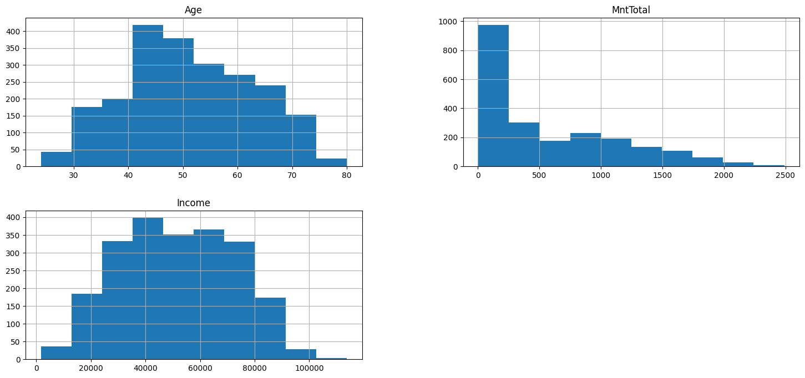

**Conclusao:** As variaveis numericas apresentam distribuicoes diferentes entre si. `Income` e `MntTotal` mostram concentracao em faixas especificas, indicando que existe diferenca relevante entre clientes de menor e maior valor.

### Outliers em MntTotal

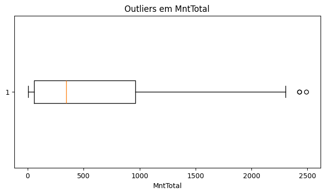

**Conclusao:** A coluna `MntTotal` possui clientes com gasto muito acima da maior parte da base. Esses casos podem representar clientes premium, mas tambem podem distorcer medias e modelos, por isso foram analisados separadamente antes do tratamento.

### Outliers em Income

**Conclusao:** A coluna `Income` tambem foi avaliada com a regra de IQR. Essa etapa ajuda a identificar rendas muito afastadas do comportamento geral da base e reduz o risco de conclusoes enviesadas em analises que cruzam renda com consumo.

### Escolaridade dos clientes

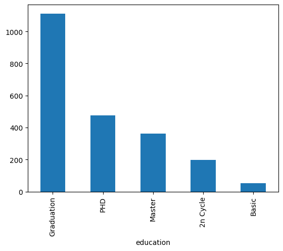

**Conclusao:** A maior parte da base esta concentrada em alguns niveis de escolaridade, o que ajuda a entender o publico predominante e pode apoiar campanhas mais direcionadas.

### Faixa etaria

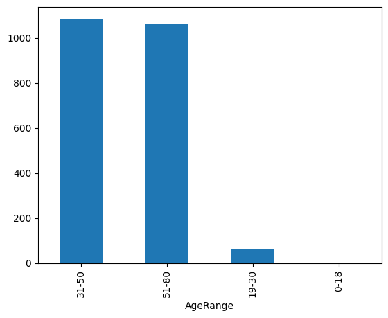

**Conclusao:** A base se concentra principalmente nas faixas adultas, especialmente entre clientes de 31 a 50 anos e 51 a 80 anos. Isso indica que o consumo analisado e mais forte em publicos adultos e maduros.

### Teenhome e Kidhome por faixa etaria

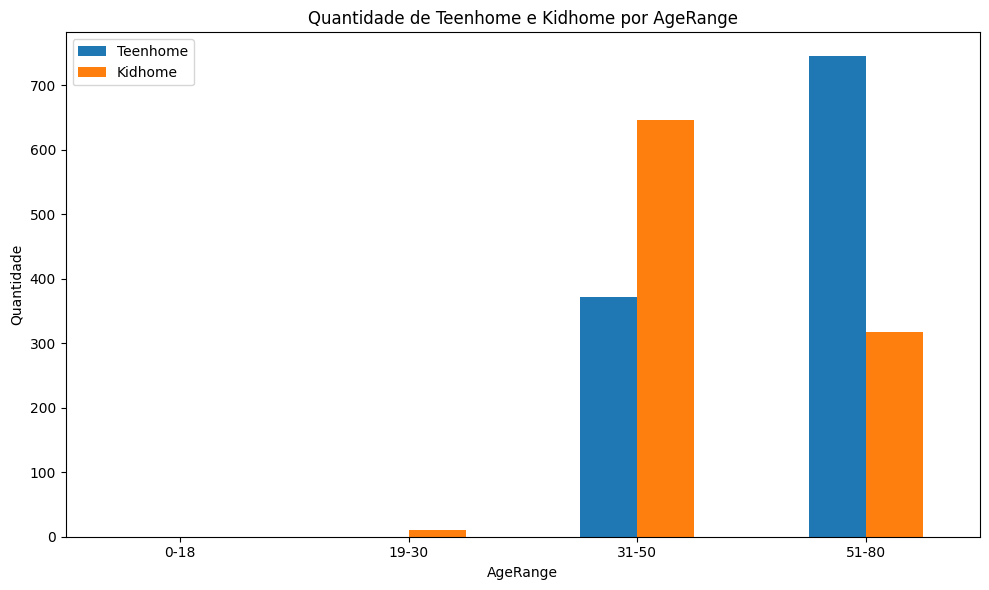

**Conclusao:** A soma de `Teenhome` e `Kidhome` por `AgeRange` mostra como a presenca de adolescentes e criancas varia entre as faixas etarias. Essa leitura complementa o perfil demografico e pode apoiar campanhas mais aderentes a diferentes composicoes familiares.

### Estado civil

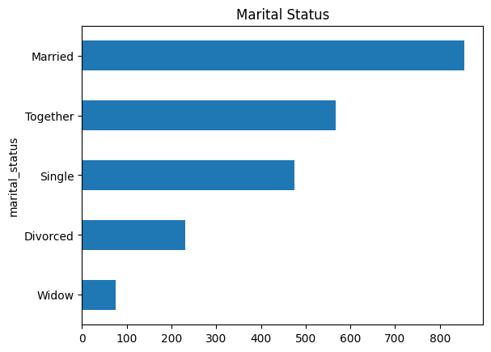

**Conclusao:** O estado civil mostra grupos com volumes diferentes de clientes. Essa variavel pode ser util para cruzar comportamento de compra com composicao familiar e estilo de vida.

### Produtos consumidos

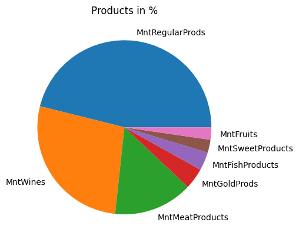

**Conclusao:** Algumas categorias de produto concentram maior volume de gasto, sugerindo que o mix de consumo nao e uniforme. Essas categorias podem ser priorizadas em campanhas e recomendacoes.

### Comparacao entre categorias de produtos

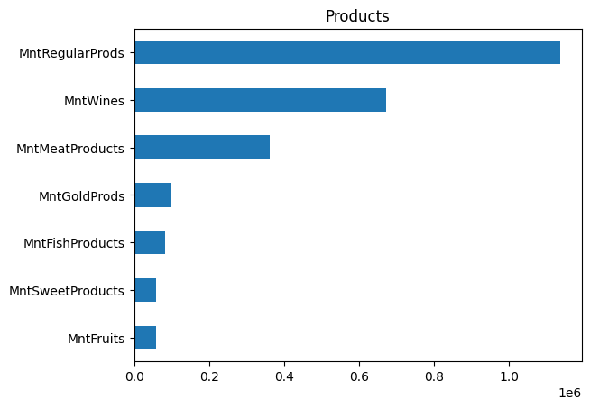

**Conclusao:** A comparacao reforca quais produtos possuem maior participacao no gasto total. Categorias com melhor desempenho podem indicar preferencias claras dos clientes da base.

### Reclamos dos clientes

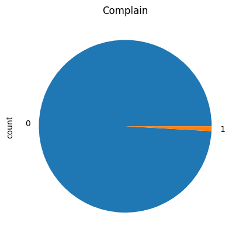

**Conclusao:** A quantidade de clientes com reclamacao parece baixa em relacao ao total, indicando que `Complain` pode ter pouca variacao. Ainda assim, ela pode ser importante para avaliar risco de churn ou insatisfacao.

### Compras por canal

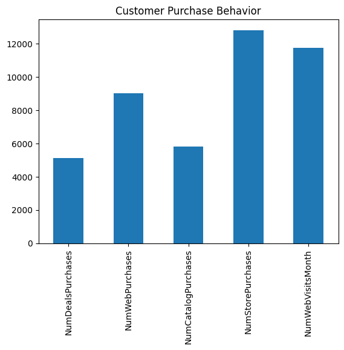

**Conclusao:** Os canais de compra apresentam comportamentos diferentes. Essa visao ajuda a entender se os clientes compram mais pela web, catalogo, loja ou outros meios disponiveis no dataset.

### Clusterizacao dos clientes

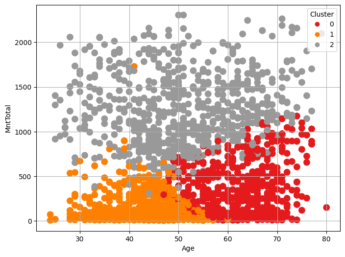

**Conclusao:** A clusterizacao separa clientes em grupos com perfis distintos de idade, renda e gasto total. Isso permite trabalhar estrategias diferentes para cada segmento em vez de tratar todos os clientes da mesma forma.

### Maior cluster por MntTotal

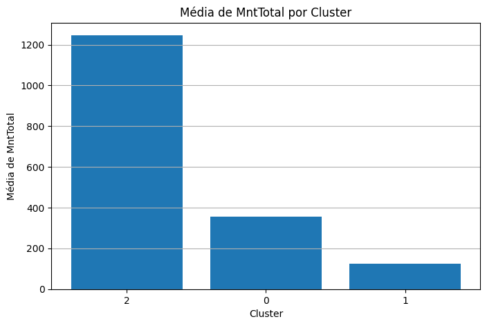

**Conclusao:** O cluster com maior `MntTotal` medio representa o grupo de maior valor. Esse segmento deve ser priorizado para acoes de retencao, campanhas premium e analises mais detalhadas de comportamento.

### Correlacao das variaveis numericas

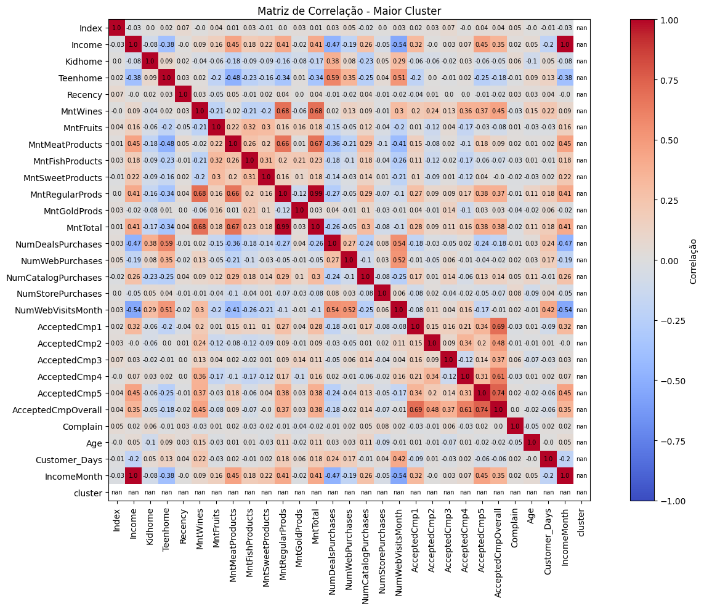

**Conclusao:** A matriz de correlacao mostra quais variaveis se movem juntas. Relacoes positivas com `MntTotal` ajudam a identificar fatores associados a maior gasto.

### Correlacao no maior cluster

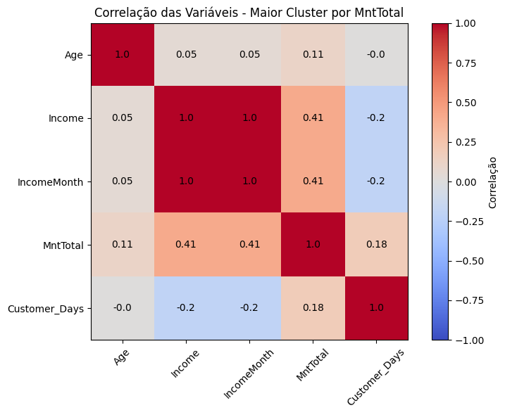

**Conclusao:** Ao analisar apenas o maior cluster, a correlacao fica mais focada no comportamento dos clientes de alto valor. Isso ajuda a entender quais variaveis explicam melhor o consumo dentro do segmento mais relevante.

### Dispersao entre Income e MntTotal

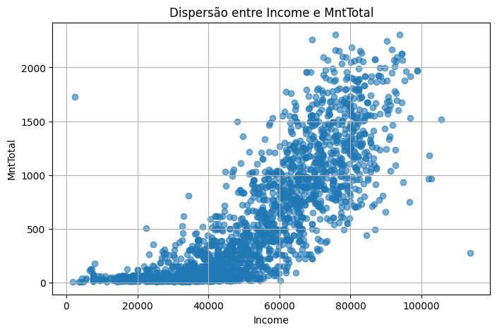

**Conclusao:** O grafico de dispersao permite avaliar a relacao entre renda e gasto total. A tendencia geral indica que clientes com maior renda tendem a ter maior potencial de gasto, embora a relacao nao seja perfeitamente linear.

### Dispersao entre Income e MntTotal no maior cluster

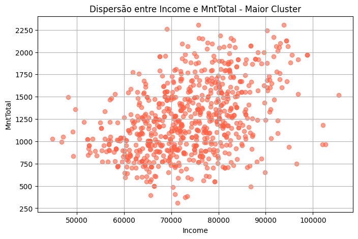

**Conclusao:** No maior cluster, a relacao entre `Income` e `MntTotal` fica mais especifica para clientes de alto valor. Essa analise ajuda a identificar perfis que combinam alta renda com alto consumo.

### Previsao simples de MntTotal por faixa etaria

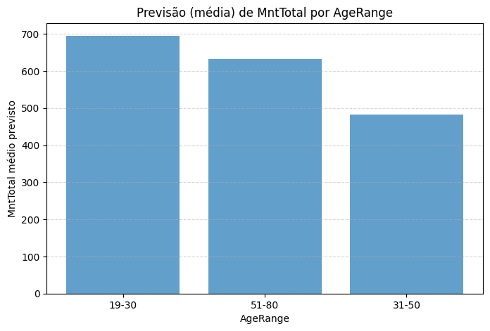

**Conclusao:** Foi criada uma previsao simples usando a media de `MntTotal` por `AgeRange` como valor estimado. O resultado indica maior media prevista para clientes de 19 a 30 anos, seguida pelas faixas de 51 a 80 e 31 a 50 anos. O RMSE de 566.84 mostra que essa abordagem funciona como linha de base inicial, mas ainda pode ser aprimorada com mais variaveis e modelos mais robustos.

## Tecnologias utilizadas

- Python
- pandas
- NumPy
- matplotlib
- scikit-learn
- Jupyter Notebook

## Status

Projeto em desenvolvimento, com novas analises e visualizacoes sendo adicionadas conforme a evolucao do estudo.
